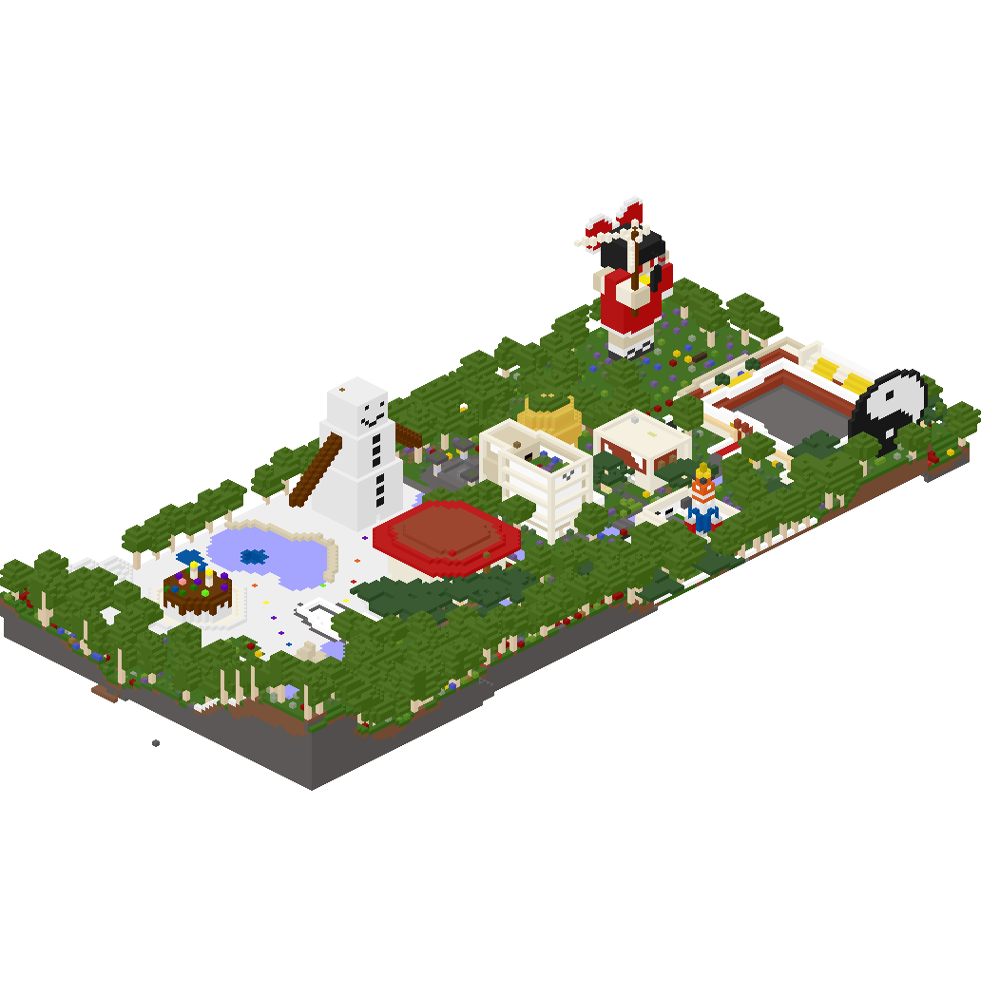
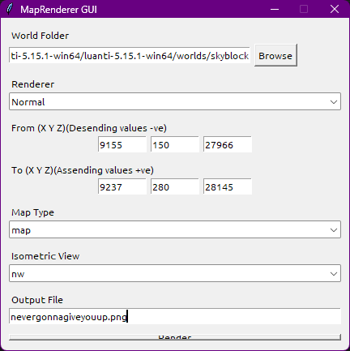

# MapRenderer v2

A Go-based renderer for **Minetest/Luanti** worlds with both a command-line interface and a graphical user interface (GUI).


---

# Features

- Render **Flat Maps**
- Render **Isometric Maps**
- Four isometric camera directions
  - `ne`
  - `nw`
  - `se`
  - `sw`
- Multiple renderer profiles
  - Normal
  - No Trees
  - No Flowers
  - No Greenery
  - Optional transparent output
  - Automatic `colors.txt` support
  - Windows GUI included


---

# Screenshots

## Isometric



---

## Flat


---

## GUI




---

# Installation

## Windows

Clone the repository

```bash
git clone https://github.com/ParamDroid/maprenderer-v2.git
cd maprenderer-v2
```

Build

```bat
build.bat
```

or manually

```bat
set CGO_ENABLED=1
go build -o Python_GUI\bin\maprenderer.exe ./cmd/maprenderer
```

---

## Linux

Clone

```bash
git clone https://github.com/ParamDroid/maprenderer-v2.git
cd maprenderer-v2
```

Build

```bash
chmod +x build.sh
./build.sh
```

or manually

```bash
export CGO_ENABLED=1
go build -o Python_GUI/bin/maprenderer ./cmd/maprenderer
```

---

# Python GUI

Run directly

```bash
python Python_GUI/Python_GUI.py
```

or use the compiled executable

```
Python_GUI.exe
```

---

# Command Line Usage

Display help

```bash
maprenderer -help
```

Render a flat map

```bash
maprenderer \
-world /path/to/world \
-from -200,-50,-200 \
-to 200,100,200 \
-type map
```

Render an isometric map

```bash
maprenderer \
-world /path/to/world \
-from -200,-50,-200 \
-to 200,100,200 \
-type isometric \
-view nw
```

---

# Supported Isometric Views

| View | Description |
|------|-------------|
| ne | North-East |
| nw | North-West |
| se | South-East |
| sw | South-West |

---

# Renderer Profiles

| Profile | Description |
|----------|-------------|
| Normal | Render everything |
| No Trees | Removes tree nodes |
| No Flowers | Removes flowers and flora |
| No Greenery | Removes trees and flowers |

---


# Credits

Original project:

https://github.com/minetest-go/maprenderer

This project extends the original renderer with:

- Multiple camera directions
- Python GUI
- Additional renderer profiles
- Improved usability
- Project restructuring

---

# License

Source code is licensed under the **MIT License**.

See the `LICENSE` file for details.

---

# Contributing

Issues, feature requests, and pull requests are welcome.

---

# Acknowledgements

Thanks to:

- The original **maprenderer** project
- Minetest / Luanti developers

